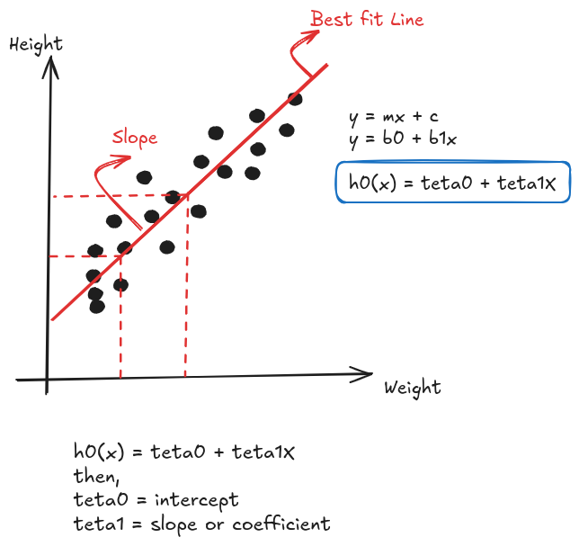

# Regressão Linear Simples

`Supervised ML -> Regression`

`New Weight ---> MODEL ---> Height`

| Weight | Height |
| ------ | ------ |
| 74     | 170    |
| 80     | 180    |
| 75     | 175.5  |

## Compreendo a equação da Regressão Linear

## Função de Custo

$$
J(\theta) = \frac{1}{2m} \sum_{i=1}^{m} \left( h_\theta(x^{(i)}) - y^{(i)} \right)^2
$$

onde:

- $J(\theta)$ é a função de custo,
- $m$ é o número de exemplos de treinamento,
- $h_\theta(x^{(i)})$ é a predição do modelo para o exemplo $i$,
- $y^{(i)}$ é o valor real para o exemplo $i$,
- $\theta$ representa os parâmetros do modelo.

## Algoritmo de Convergência

1. Inicialize os parâmetros $\theta_0, \theta_1, \dots, \theta_n$ com valores aleatórios ou zeros.
2. Repita até a convergência (ou por um número definido de iterações):
   - Atualize cada parâmetro $\theta_j$ de acordo com a seguinte regra:

$$
\theta_j := \theta_j - \alpha \frac{\partial}{\partial \theta_j} J(\theta)
$$

   onde:

- $\alpha$ é a taxa de aprendizado,
- $\frac{\partial}{\partial \theta_j} J(\theta)$ é o gradiente da função de custo em relação ao parâmetro $\theta_j$,
- $J(\theta)$ é a função de custo, que para a regressão linear é:

$$
J(\theta) = \frac{1}{2m} \sum_{i=1}^{m} \left( h_\theta(x^{(i)}) - y^{(i)} \right)^2
$$

3. Continue atualizando os parâmetros até que o gradiente seja suficientemente pequeno (convergência), indicando que uma solução ótima foi encontrada.

### Atualização dos parâmetros no caso de regressão linear:

Para cada parâmetro $\theta_j$:

$$
\theta_j := \theta_j - \alpha \cdot \frac{1}{m} \sum_{i=1}^{m} \left( h_\theta(x^{(i)}) - y^{(i)} \right) x_j^{(i)}
$$

onde:

- $h_\theta(x^{(i)}) = \theta_0 + \theta_1 x_1^{(i)} + \dots + \theta_n x_n^{(i)}$ é a função de predição (hipótese),
- $x_j^{(i)}$ é o valor da característica $j$ para o exemplo $i$,
- $m$ é o número de exemplos de treinamento.

# Regressão Linear Múltipla

A fórmula da regressão linear múltipla é dada por:

$$
h(\theta) = \theta_0 + \theta_1 x_1 + \theta_2 x_2 + \dots + \theta_n x_n + \epsilon
$$

onde:

- $y$ é a variável dependente (a variável que queremos prever),
- $\theta_0$ é o intercepto (termo independente),
- $\theta_1, \theta_2, \dots, \theta_n$ são os coeficientes das variáveis independentes,
- $x_1, x_2, \dots, x_n$ são as variáveis independentes (também chamadas de preditores ou features),
- $\epsilon$ é o termo de erro ou ruído, que captura a diferença entre os valores reais e as predições do modelo.

# Métricas de Performance usadas em RL

A fórmula para o coeficiente de determinação ( R^2 ) é dada por:

$$
R^2 = 1 - \frac{\sum_{i=1}^{m} \left( y^{(i)} - \hat{y}^{(i)} \right)^2}{\sum_{i=1}^{m} \left( y^{(i)} - \bar{y} \right)^2}
$$

onde:

- $y^{(i)}$ é o valor real,
- $\hat{y}^{(i)}$ é o valor predito pelo modelo,
- $\bar{y}$ é a média dos valores reais,
- $m$ é o número de observações.

A fórmula para o \( R^2 \) ajustado é dada por:

$$
R^2_{ajustado} = 1 - \left( \frac{1 - R^2}{n - p - 1} \right) (n - 1)
$$

onde:

- $R^2$ é o coeficiente de determinação,
- $n$ é o número de observações,
- $p$ é o número de variáveis independentes (ou preditores).

# MSE, MAE, RMSE

### 1. **MSE - Mean Squared Error (Erro Quadrático Médio)**

A fórmula do MSE é a seguinte:

$$
MSE = \frac{1}{n} \sum_{i=1}^{n} (y_i - \hat{y}_i)^2
$$

Onde:

- $( n )$ é o número total de observações.
- $( y_i )$ é o valor real da \(i\)-ésima observação.
- $( \hat{y}_i )$ é o valor previsto da \(i\)-ésima observação.

#### Explicação:

O MSE calcula a média dos quadrados das diferenças entre os valores reais e os valores previstos. A penalização é maior para erros maiores devido à elevação ao quadrado, o que torna essa métrica sensível a outliers. Quanto menor o valor de MSE, melhor o modelo está ajustado aos dados.

---

### 2. **MAE - Mean Absolute Error (Erro Absoluto Médio)**

A fórmula do MAE é a seguinte:

$$
MAE = \frac{1}{n} \sum_{i=1}^{n} |y_i - \hat{y}_i|
$$

Onde:

- $( n )$ é o número total de observações.
- $( y_i )$ é o valor real da \(i\)-ésima observação.
- $( \hat{y}_i )$ é o valor previsto da \(i\)-ésima observação.

#### Explicação:

O MAE calcula a média das diferenças absolutas entre os valores reais e os previstos. Diferente do MSE, o MAE não eleva os erros ao quadrado, sendo menos sensível a outliers. Ele representa uma média direta dos erros absolutos, com todos os erros tendo o mesmo peso.

---

### 3. **RMSE - Root Mean Squared Error (Raiz do Erro Quadrático Médio)**

A fórmula do RMSE é a seguinte:

$$
RMSE = \sqrt{\frac{1}{n} \sum_{i=1}^{n} (y_i - \hat{y}_i)^2}
$$

Onde:

- $( n )$ é o número total de observações.
- $( y_i )$ é o valor real da \(i\)-ésima observação.
- $( \hat{y}_i )$ é o valor previsto da \(i\)-ésima observação.

#### Explicação:

O RMSE é a raiz quadrada do MSE, o que significa que ele traz o erro de volta à mesma unidade dos dados originais. Assim como o MSE, o RMSE é sensível a outliers, mas tem uma interpretação mais direta em termos da escala original dos dados.

# Overfitting and Underfitting

| database |      Generalized Model      |         Overfitting         | Underfitting                 |
| :------: | :--------------------------: | :--------------------------: | ---------------------------- |
|  TRAIN  |   good accuracy (low bias)   |   good accuracy (low bias)   | bad accuracy (high bias)     |
|   TEST   | good accuracy (low variance) | bad accuracy (high variance) | bad accuracy (low variance) |
